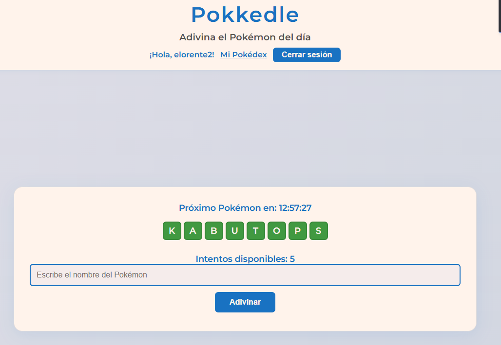
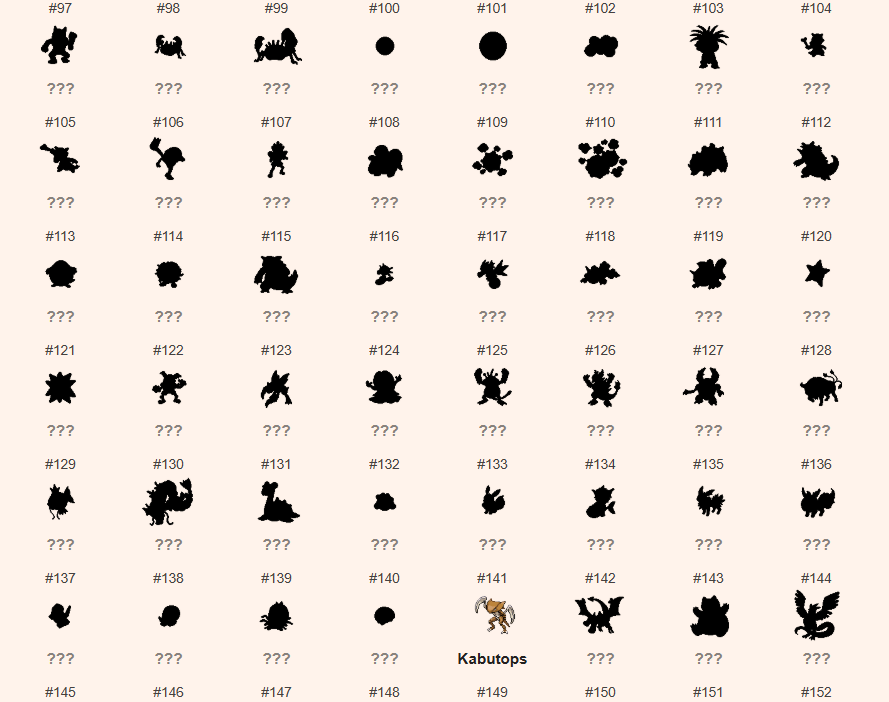

# Pokkedle

¡Bienvenido a Pokkedle!  
Un juego diario tipo Wordle donde debes adivinar el Pokémon del día. Si te registras, podrás guardar tu progreso y desbloquear tu propia Pokédex personal.

## 🚀 Características

- Adivina el Pokémon del día con intentos limitados.
- Modal de felicitación con sprite al acertar.
- Temporizador en tiempo real hasta el próximo Pokémon.
- Registro y login de usuarios (opcional).
- Pokédex personal: desbloquea Pokémon al acertarlos.
- Visualización de todos los Pokémon, mostrando siluetas negras para los no desbloqueados.
- Responsive y diseño moderno.

## 🖼️ Capturas de pantalla




## 📝 Instalación y uso local

1. **Clona el repositorio:**
   ```bash
   git clone https://github.com/loreentee7/Pokkedle.git
   cd Pokkedle
   ```

2. **Abre la carpeta en VS Code o tu editor favorito.**

3. **Usa Live Server o cualquier servidor local para abrir `index.html`.**
   - Ejemplo con Python:
     ```bash
     python -m http.server 8000
     ```
   - O con [Live Server](https://marketplace.visualstudio.com/items?itemName=ritwickdey.LiveServer) en VS Code.

4. **¡Juega y disfruta!**

## 📦 Estructura del proyecto

```
Pokkedle/
├── index.html
├── pokedex.html
├── login.html
├── register.html
├── styles.css
├── script.js
├── pokedex.js
├── login.js
├── register.js
└── src/
    ├── api/
    └── utils/
```

## ⚠️ Aviso legal

Este proyecto es solo para fines educativos y de fans.  
Pokémon es una marca registrada de Nintendo, Game Freak y The Pokémon Company.  
No monetices ni publiques este proyecto como producto comercial sin permiso de los titulares de la marca.

